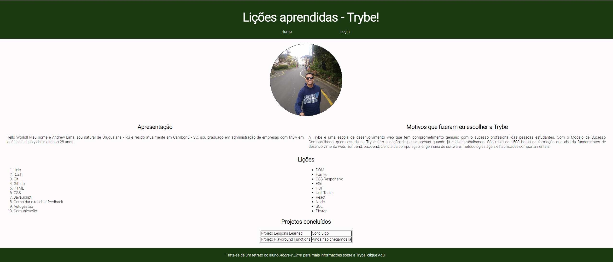

# Projeto Lessons Learned (Primeiro projeto desenvolvido)

No contexto deste projeto inaugural, tive a oportunidade de aplicar e fortalecer minhas competências em HTML e CSS. O desafio consistiu em criar uma página web repleta de informações abordando o conteúdo assimilado ao longo do curso até a data do projeto. Dentre os principais objetivos, estava a formatação estilizada e a adoção de uma semântica apropriada para melhorar o ranqueamento da página nos motores de busca.

## Habilidades desenvolvidas

Durante a execução deste projeto, foram amplamente aprimoradas as seguintes habilidades:

- Entender como funciona a estrutura (HTML) de uma página;
- Entender como o estilo (CSS) é aplicado à página;
- Construir páginas utilizando HTML e CSS;
- Realizar manutenções em páginas já existentes;
- Aplicar Layout e Box Model na prática.

## O que foi desenvolvido pelo autor

Todo o conteúdo e elementos presentes nos arquivos "index.html" e "style.css" foram desenvolvidos exclusivamente por mim, representando minha contribuição integral a este projeto. É importante mencionar que os demais arquivos foram elaborados pela equipe da Trybe como parte do contexto mais amplo do projeto.

## Requisitos do projeto

1. Adicionar uma cor de fundo específica para a página;
2. Adicionar uma barra superior com um título;
3. Adicionar uma foto a do autor à página;
4. Adicionar uma lista de lições aprendidas à página;
5. Criar uma lista de lições que ainda deseja aprender para a página;
6. Adicionar um rodapé para a página;
7. Inserir pelo menos um link externo na página;
8. Criar um artigo sobre o aprendizado do autor;
9. Crie uma tag html aside que contenha uma breve descrição sobre o autor;
10. Aplicar elementos HTML de acordo com o sentido e propósito de cada um deles;
11. Adicionar uma tabela à página;
12. Utilização de Box model;
13. Alterar atributos relacionados às fontes;
14. Posicionar a tag article e a tag aside uma ao lado do outra.

## Demonstração de como ficou o projeto depois de pronto

